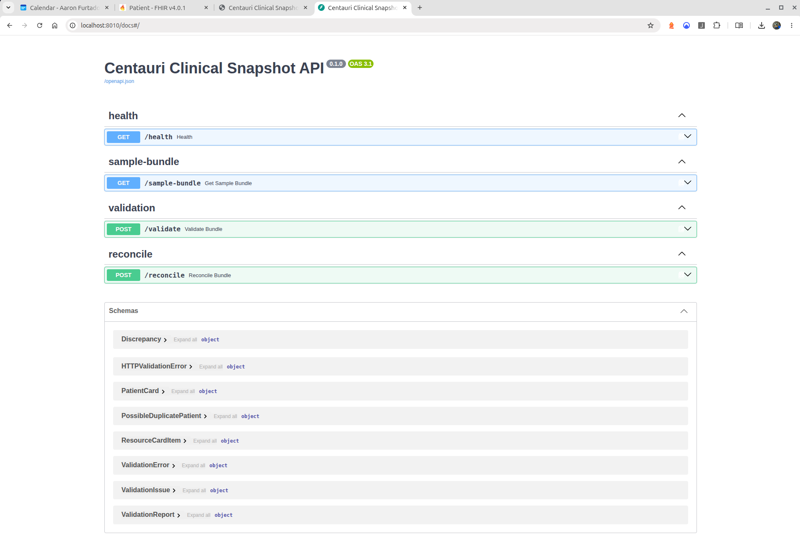
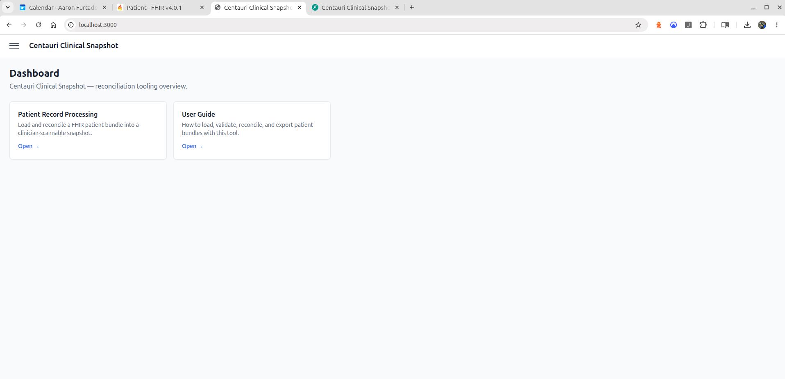
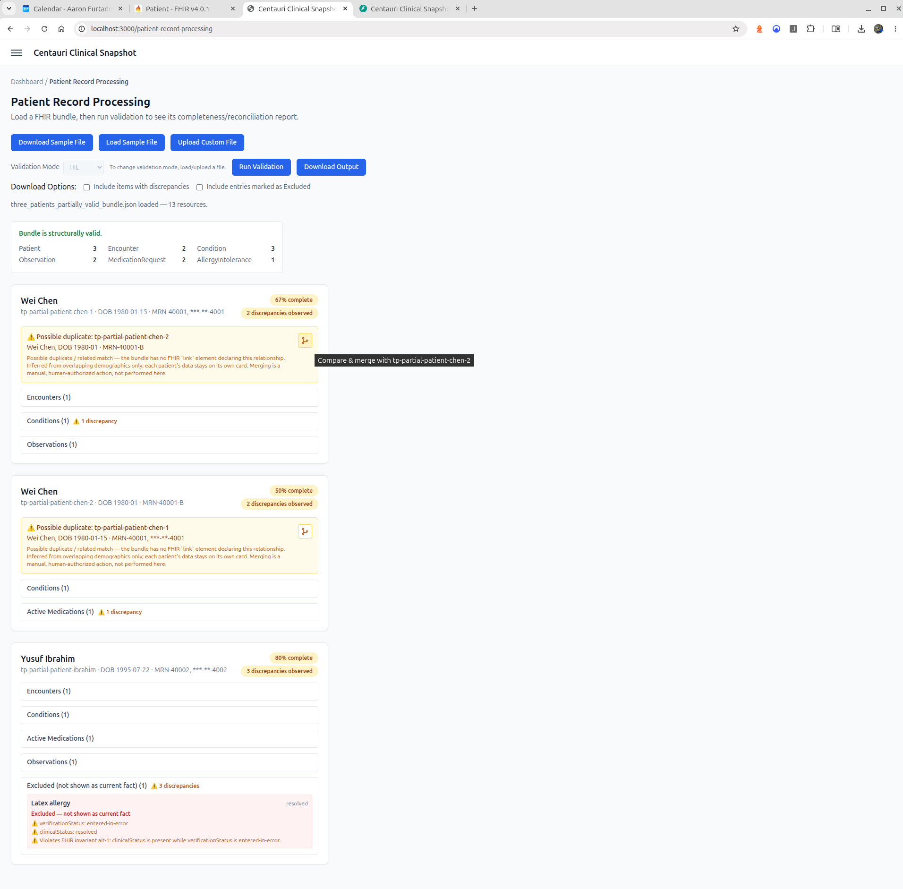
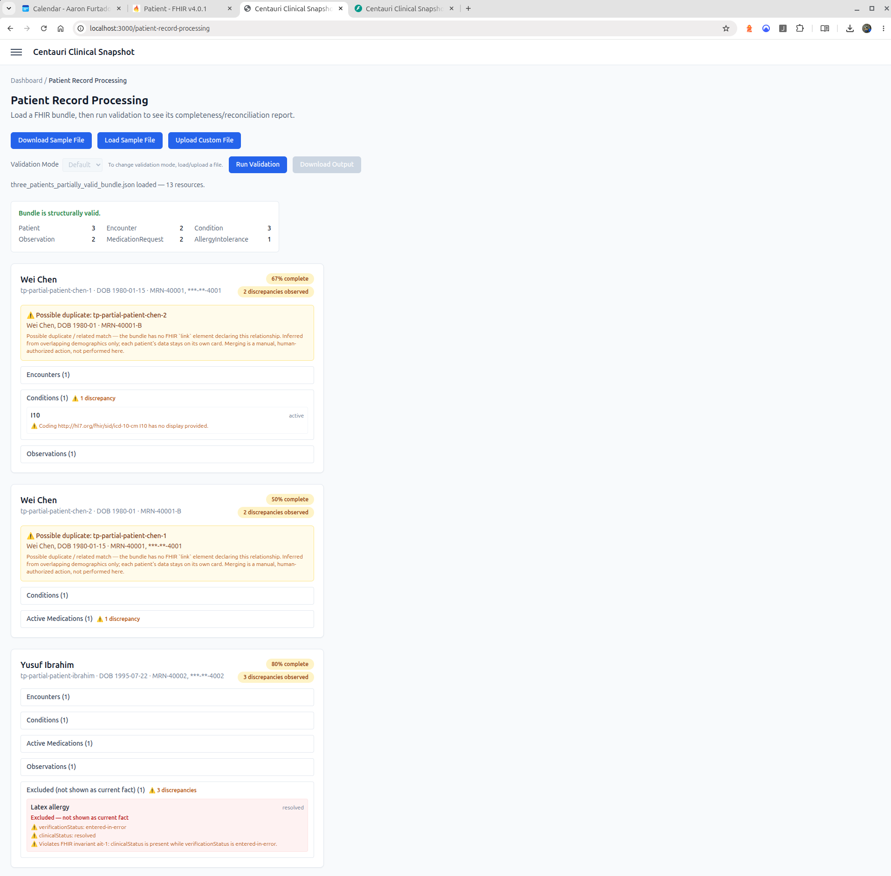
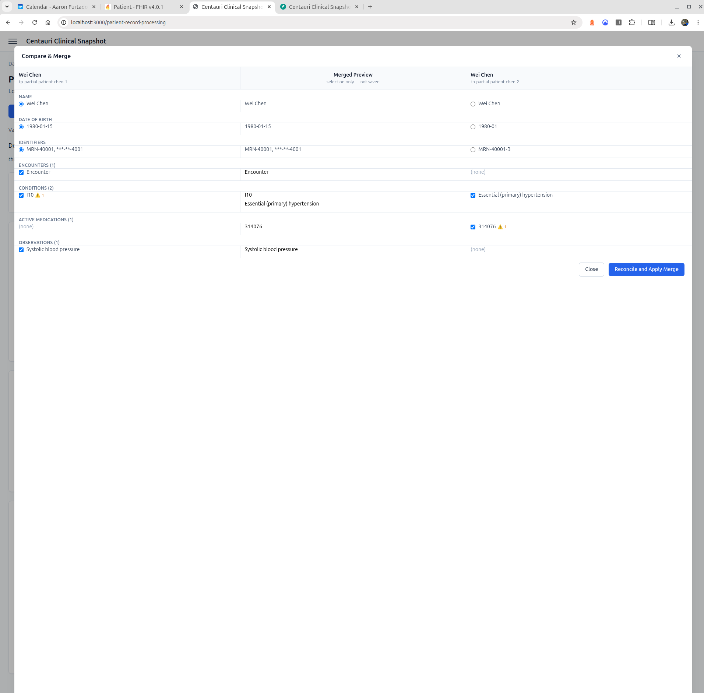

# Overview

**Centauri Clinical Snapshot** is my reconciliation tool for a single messy FHIR R4 patient bundle:
it turns the raw bundle into a normalized, discrepancy-annotated, safe-to-display snapshot of each
patient's demographics, problems, medications, allergies, encounters, and observations.

The source bundle (`inputdata/scenario1_fhir_bundle[78].json`) is real-world-messy on purpose. It
has two `Patient` resources for the same person with no FHIR `link` between them, resources marked
`entered-in-error`/`inactive`/`resolved`, dangling references, missing coding `display` values, and
mixed date precision. My goal was to surface that messiness honestly rather than paper over it:
nothing is guessed, backfilled, or silently dropped, and nothing is merged without an explicit
human decision. See the [Decision Log](#decision-log-and-table-of-contents) below for the full
rationale behind each of those calls.

I framed this as patient-summary/reconciliation (USCDI/IPS-shaped), not a PAS/prior-authorization
workflow, so there are no procedure codes and no admission/discharge/service-date logic.

**Stack:** FastAPI + Pydantic v2 + uvicorn (backend), Next.js + TypeScript + React (frontend),
Docker Compose.

# Setup and Run Instructions

**Prerequisites:** Docker and Docker Compose. No other local tooling (Python/Node versions, etc.)
is required to run the app. I wanted the "if we cannot run it, we cannot evaluate it" constraint
handled entirely through Compose, by design (see [`Assumptions.md` → Process](project-plan/Assumptions.md#process)).

```bash
# from the repo root
docker compose up
```

This starts both services:

- **Backend**: FastAPI/uvicorn at **http://localhost:8010** (`/health`, interactive docs at `/docs`).
- **Frontend**: Next.js app at **http://localhost:3000**.

> The backend is mapped to host port `8010`, not `8000`, since `8000` is commonly taken by other
> local dev servers and I wanted to avoid a default collision. The container-internal port is still
> `8000`.



```bash
docker compose down
```

This stops and removes the containers. There's no database or volumes to worry about: the app is
stateless, one bundle per validation pass, with no persistence between requests.

# Features

Everything lives under a single page, **Patient Record Processing** (`/patient-record-processing`),
reached from the Dashboard. I also built a **User Guide** page (`/user-guide`), available in-app
with step-by-step usage instructions for everything below.



### Loading a bundle

- **Download Sample File** saves the built-in sample bundle to disk for local inspection.
- **Load Sample File** loads the built-in sample bundle directly into the page.
- **Upload Custom File** loads your own FHIR-conformant JSON bundle from disk, parsed client-side
  with no backend round trip needed just to "load" it.
- Loading any new file clears all previous results and re-enables Validation Mode.

Additional Sample test files can be found at: [backend/tests/fixtures](backend/tests/fixtures)

### Validation Mode

- **Default (auto-mode, MVP)** is read-only evaluation. Every distinct `Patient` resource always
  gets its own card, and possible duplicate patients are flagged but never automatically combined.
  Merging is a decision only a human reviewer makes.
- **HIL (Human-in-Loop, manual-mode, stretch)** adds the ability to manually merge
  possible-duplicate patients and to export a cleaned output bundle.
- The mode selector locks as soon as **Run Validation** produces a report (with a visible inline
  hint plus a tooltip explaining why). Loading a new file unlocks it again.



### Run Validation

This sends the loaded bundle to the backend, which checks structural validity (Pydantic v2 models)
and returns one patient card per distinct `Patient` resource found. Each card shows:

- A completeness percentage for that patient's clinical data.
- Collapsible sections (Encounters, Conditions, Active/Past Medications, Allergies, Observations,
  Excluded). Any section containing discrepancies shows a ⚠ warning and count next to its title,
  even while collapsed, so nothing needing attention is hidden behind a fold.
- Every discrepancy kind from my research catalog: `entered-in-error`/inactive/resolved status
  routed to a dedicated Excluded bucket (never shown as current fact, never silently dropped),
  FHIR invariant violations, missing coding `display` text, dangling references, SNOMED/LOINC
  code-shape mismatches, unconfirmed verification status, and possible-duplicate-patient flags.
  All of it is shown as-is and labeled, never guessed into something more complete or certain than
  the source data.



### Merge possible duplicates (HIL mode)

A merge icon appears on any card the backend flagged as a possible match (name plus birth date).
It opens a 3-pane compare view:

- **Patient A** (left) and **Patient B** (right): raw data side by side.
- **Merged Preview** (center): a live union, built from per-field demographic choices (name, birth
  date, identifiers; pick A or B) and per-item checkboxes on each side's clinical resources.
- **Reconcile and Apply Merge** builds the actual merged FHIR bundle from your selections and
  re-runs the full backend validation pipeline against it, so every card on the page, not just the
  merged one, reflects the new completeness and discrepancies.



### Download Output (HIL mode)

This exports the current working bundle (post-merge if applied, otherwise as loaded/validated) as
a clean FHIR R4 JSON file, named `fhir-r4-patient-record-<yyyy>-<mm>-<dd>-<hh>-<mm>-<ss>.json`. Two
options, both off by default, keep the default export as the cleanest cut:

- **Include items with discrepancies**
- **Include entries marked as Excluded**

Patients themselves are always included.

# Decision Log and Table of Contents

Everything below is a genuine, reasoned decision I made along the way, not an unstated default.
Rather than restate all of it here, this links straight to where I made each call and why:

- **[`project-plan/Assumptions.md`](project-plan/Assumptions.md)**, my canonical decision log. Read this first.
  - [Data handling](project-plan/Assumptions.md#data-handling): what counts as current clinical fact vs. excluded/flagged (entered-in-error/inactive/resolved handling, my two-Patient duplicate stance, dangling references, missing `coding.display`, date precision, verification status).
  - [Scope](project-plan/Assumptions.md#scope): what I explicitly put in vs. left out of this build.
  - [Process](project-plan/Assumptions.md#process): how I intended the app to be run and evaluated.
  - [Still open](project-plan/Assumptions.md#still-open): decisions I've deliberately left unresolved rather than guessed at, with my reasoning for why each is still open.
- **[`project-plan/ProjectPlan.md`](project-plan/ProjectPlan.md)**: my original brief-to-goals translation, what's Must Have (MVP/auto-mode) vs. Good to Have (HIL/manual-mode stretch).
- **[`project-plan/ResearchNotes.md`](project-plan/ResearchNotes.md)**: the FHIR-spec-vs-actual-bundle research my discrepancy detection is grounded in ([domain framing](project-plan/ResearchNotes.md#domain-framing), per-resource-type gap analysis).
- **[`project-plan/Architecture.md`](project-plan/Architecture.md)**: my tooling/package/build-system choices and why.
- **[`project-plan/HLD.md`](project-plan/HLD.md)**: high-level design, updated per phase/iteration as the system grew.
- **[`project-plan/LLD.md`](project-plan/LLD.md)**: low-level design, backend package structure, API contracts, frontend component/state design, written incrementally alongside the real implementation rather than speculatively upfront.
- **[`project-plan/TestPlan.md`](project-plan/TestPlan.md)**: my test strategy, the full manual verification record per iteration, and what's still open on the automated-coverage side.
- **[`project-plan/GroundRules.md`](project-plan/GroundRules.md)**: the working agreement I built this project under (no direct git operations by the AI agent, every iteration ends with a change summary, data-safety judgment calls get flagged inline rather than buried in a diff).
