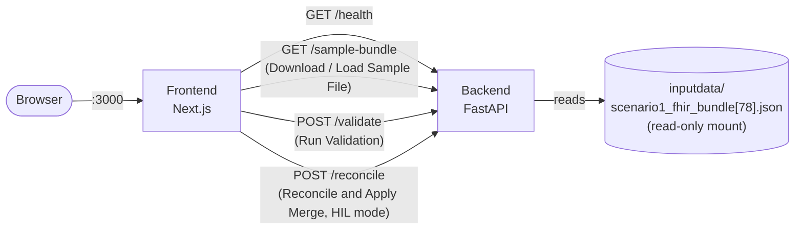
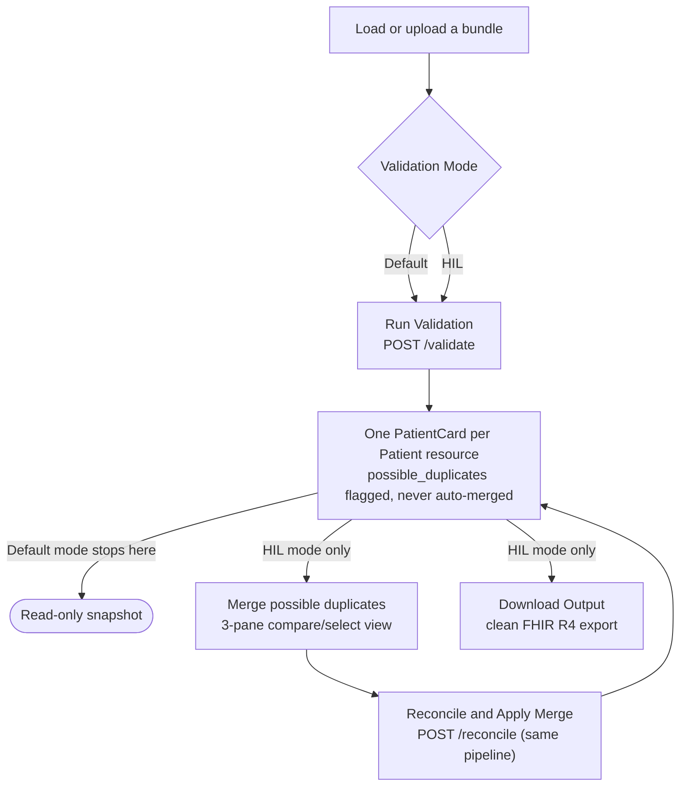

# High-Level Design — Centauri Clinical Snapshot

Kept intentionally light per Phase 01 feedback — grown incrementally per Phase 02 iteration against
real code, not speculatively ahead of it. See `project-plan/Assumptions.md` for the decisions this
implements, and `project-plan/LLD.md` for the concrete contracts (endpoint shapes, file layout).

## System context

Both run under `docker compose up`. No database, no auth. The backend is fully stateless — every
request carries the whole bundle and gets back a complete report; nothing is retained between
calls. The frontend is the only place a loaded bundle's full content lives between requests (see
`LLD.md`'s HIL merge section for why that matters).

## Two validation modes, one shared backend pipeline

Both modes described in `ProjectPlan.md` (`Default`/auto-mode = MVP, `HIL`/manual-mode = stretch)
run through the same `POST /validate` → `run_validation()` pipeline — the mode itself is currently
frontend-only UI state, not sent to the backend at all:

The key design decision this encodes (see `Assumptions.md` → Data handling): **matching two
`Patient` resources as a likely duplicate is always safe to compute and display; combining their
data is never automatic.** Default mode can see and flag a possible duplicate; only HIL mode can
act on it, and only via an explicit, reviewable, per-field/per-item selection.

## Phase 01 (done)

- Backend: minimal FastAPI app, one `/health` endpoint, runs under uvicorn in its own container.
- Frontend: minimal Next.js app, one page, calls the backend on load to prove connectivity.
- `docker-compose.yml` wiring both up, reachable from the browser at `localhost:3000`.
- Dev-experience fix (Iteration 01 feedback): source bind-mounted into both containers, file
  watching set to polling (`WATCHPACK_POLLING` / `WATCHFILES_FORCE_POLLING`) rather than `inotify`,
  since the container's `inotify` watch limit is a host-kernel setting no container config can
  raise. Without this, edits required a full image rebuild to appear at all.

## Phase 02 — Iteration 01 (done)

- Dashboard (`/`, default landing page) with header + hamburger sidebar (one menu item so far:
  Patient Record Processing) and one widget navigating to it.
- Patient Record Processing page (`/patient-record-processing`) — stub at this point.
- Nav-back-to-Dashboard: header title doubles as a home link; a `Breadcrumb` component is used on
  non-Dashboard pages.

## Phase 02 — Iteration 02 (done)

- `GET /sample-bundle` — backend reads `inputdata/scenario1_fhir_bundle[78].json` (mounted
  read-only into the container) and returns it as-is, no parsing/normalization. One endpoint backs
  both the frontend's "Download Sample File" (saved client-side via a Blob) and "Load Sample File"
  (kept in React state) actions — single source of truth, no duplicated bundle copies.
- Patient Record Processing page: Download/Load Sample File wired to that endpoint; Run Validation
  enables once a bundle is loaded (button-state wiring only — no validation logic yet, that's a
  later iteration); Upload Custom File / Edit Mode / Download Output stay disabled (HIL-mode
  stretch goals, per `Assumptions.md`'s MVP/stretch split).
- No normalization/reconciliation pipeline or `/patient-summary` response shape yet — still ahead.

## Phase 02 — Iteration 03 (done)

- `app/models/` — one Pydantic v2 module per FHIR resource type actually present in the bundle
  (Patient/Encounter/Condition/Observation/MedicationRequest/AllergyIntolerance), deliberately
  permissive on the FHIR invariants the bundle itself violates (`con-3`/`ait-1`) so violating
  resources still parse and can be reported on rather than rejected.
- `POST /validate` — structural validation only at this point (does the bundle parse?). Not yet
  data-quality/reconciliation-aware. Wired to the frontend's Run Validation button.

## Phase 02 — Iteration 04 (done)

- `app/clinical_normalization/` — the reconciliation + discrepancy-detection pipeline. Turns
  successfully-parsed resources into a `PatientCard`: canonical patient, resources bucketed by
  type, every item annotated with the discrepancy kinds it triggers (missing `display`, dangling
  reference, invariant violation, unconfirmed verification status, entered-in-error/inactive/
  resolved status). `POST /validate`'s response gains a `patient` field carrying this.
- Frontend `components/patient-card/` — renders the card: demographics, a completeness badge,
  possible-duplicate panel, one collapsible section per resource bucket with discrepancies
  surfaced inline, an Excluded bucket that opens by default.

## Phase 02 — Iteration 05 (done)

- **Upload Custom File** — real, client-side only (`/validate` already accepted any bundle body).
  Client-side JSON-parse and `resourceType` guard checks exist purely for fast/accurate error
  messages, not as a substitute for the backend's real structural validation, which still runs and
  is authoritative.

## Phase 02 — Iteration 06 (done — includes a real, corrected design mistake)

- Multi-patient support: a bundle with more than one `Patient` resource now produces one card per
  `Patient`, not one merged card. `POST /validate`'s response field changed from a single optional
  `patient` to `patients: list[PatientCard]`.
- **First pass got this wrong** — matched (likely-duplicate) patients were combined into a single
  card automatically. Corrected after Aaron's review: "we must not combine and group the similar
  matching patient data... This is something a authorized system user will do manually." The fix:
  `same_person()`/`cluster_patients()` (family-name + compatible-birthDate matching) are used
  *only* to populate each card's `possible_duplicates` list, never to combine resource
  attribution — every `Patient` resource always gets its own, strictly-attributed card. See
  `Assumptions.md` for the full correction history.

## Phase 02 — Iteration 07 (done) — HIL merge process, built in reviewed steps

Built deliberately as a sequence of small, independently-reviewed steps rather than one large
change, per Aaron's explicit direction. Full detail (each step, verification performed, decisions
made) lives in `LLD.md`'s "HIL merge process" section and
`implementation-phases/02/iterations/Iteration-07.md`; summarized here:

1. **Validation Mode toggle + merge icon** — `Default`/`HIL` becomes a real, switchable UI mode
   (locks once Run Validation produces a report; unlocks on loading a new file). A merge icon
   appears on cards with `possible_duplicates`, but only in HIL mode, and is inert at this step.
2. **3-pane compare/select view (`MergeView`)** — Patient A | Merged Preview | Patient B, per
   Aaron's exact spec. Demographic fields are single-choice A/B radios; clinical resources are
   per-item checkboxes on each side, unioned live into the center preview. Selection-only at this
   step — no backend call yet.
3. **"Reconcile and Apply Merge"** — `POST /reconcile` (new endpoint, same shared pipeline as
   `/validate`) actually applies the merge. The frontend builds the merged FHIR bundle client-side
   (the backend is stateless and never held the raw resources), POSTs it, and replaces the whole
   working bundle + validation report on success — every card updates, not just the merged pair.
4. **Discrepancy warning on collapsed sections** — a quality-of-life fix so a collapsed section's
   `⚠ N` count is visible without expanding it.
5. **Download Output** — exports the current working bundle (post-merge if applied) as a clean
   FHIR R4 JSON file, with opt-in checkboxes to include discrepancy-bearing or excluded items
   (both off by default). Gated to HIL mode only, per Aaron's follow-up refinement, with a
   timestamped filename (`fhir-r4-patient-record-<yyyy-mm-dd-hh-mm-ss>.json`).
6. **Mode-change discoverability hint + User Guide page** — a visible inline hint next to the
   locked Validation Mode dropdown (supplementing the existing tooltip), and a new `/user-guide`
   page (linked from the Dashboard and the sidebar) documenting all current features in the order
   a user encounters them.

**A genuine second-order finding from this iteration, worth keeping visible at this level too:**
applying a merge with an item deliberately left unchecked can orphan a *different, still-checked*
item's reference to it — confirmed live by replaying a reconcile call directly against the
backend after the UI's discrepancy count didn't match a hand-prediction. This is the concrete
argument for why `/reconcile` re-runs the complete validation pipeline server-side rather than
the frontend trying to approximate the result of a merge client-side.
