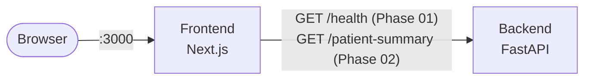

# High-Level Design — Centauri Clinical Snapshot

Kept intentionally light for Phase 01. The goal here is just: two services, running, talking to
each other, in a browser. Component boundaries, the `/patient-summary` response shape, and the
normalization pipeline internals get designed in Phase 02, against real code, not speculatively here
— see `project-plan/Assumptions.md` for the decisions already locked in from Phase 00 that Phase 02
will implement.

## System context

Both run under `docker compose up`. No database, no auth, single stateless bundle-in/report-out
pass once the pipeline exists — per `Assumptions.md`.

## Phase 01 scope

- Backend: minimal FastAPI app, one `/health` endpoint, runs under uvicorn in its own container.
- Frontend: minimal Next.js app, one page, calls the backend on load to prove connectivity.
- `docker-compose.yml` wiring both up, reachable from the browser at `localhost:3000`.
- No normalization logic, no real `/patient-summary` response shape, no component/module design
  yet — that's Phase 02, and will get its own HLD additions once there's real shape to describe.
