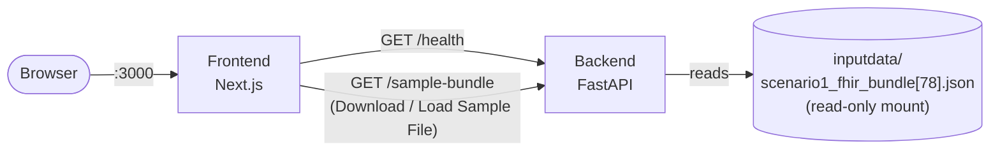

# High-Level Design — Centauri Clinical Snapshot

Kept intentionally light per Phase 01 feedback — grown incrementally per Phase 02 iteration against
real code, not speculatively ahead of it. See `project-plan/Assumptions.md` for the decisions this
implements, and `project-plan/LLD.md` for the concrete contracts (endpoint shapes, file layout).

## System context

Both run under `docker compose up`. No database, no auth, single stateless bundle-in/report-out
pass once the normalization pipeline exists — per `Assumptions.md`.

## Phase 01 (done)

- Backend: minimal FastAPI app, one `/health` endpoint, runs under uvicorn in its own container.
- Frontend: minimal Next.js app, one page, calls the backend on load to prove connectivity.
- `docker-compose.yml` wiring both up, reachable from the browser at `localhost:3000`.
- Dev-experience fix (Iteration 01 feedback): source bind-mounted into both containers, file
  watching set to polling (`WATCHPACK_POLLING` / `WATCHFILES_FORCE_POLLING`) rather than `inotify`,
  since the container's `inotify` watch limit is a host-kernel setting no container config can
  raise. Without this, edits required a full image rebuild to appear at all.

## Phase 02 — Iteration 01 (done)

- Dashboard (`/`, default landing page) with header + hamburger sidebar (one menu item so far:
  Patient Record Processing) and one widget navigating to it.
- Patient Record Processing page (`/patient-record-processing`) — stub at this point.
- Nav-back-to-Dashboard: header title doubles as a home link; a `Breadcrumb` component is used on
  non-Dashboard pages.

## Phase 02 — Iteration 02 (done)

- `GET /sample-bundle` — backend reads `inputdata/scenario1_fhir_bundle[78].json` (mounted
  read-only into the container) and returns it as-is, no parsing/normalization. One endpoint backs
  both the frontend's "Download Sample File" (saved client-side via a Blob) and "Load Sample File"
  (kept in React state) actions — single source of truth, no duplicated bundle copies.
- Patient Record Processing page: Download/Load Sample File wired to that endpoint; Run Validation
  enables once a bundle is loaded (button-state wiring only — no validation logic yet, that's a
  later iteration); Upload Custom File / Edit Mode / Download Output stay disabled (HIL-mode
  stretch goals, per `Assumptions.md`'s MVP/stretch split).
- No normalization/reconciliation pipeline or `/patient-summary` response shape yet — still ahead.
