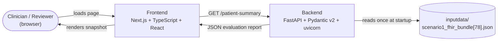
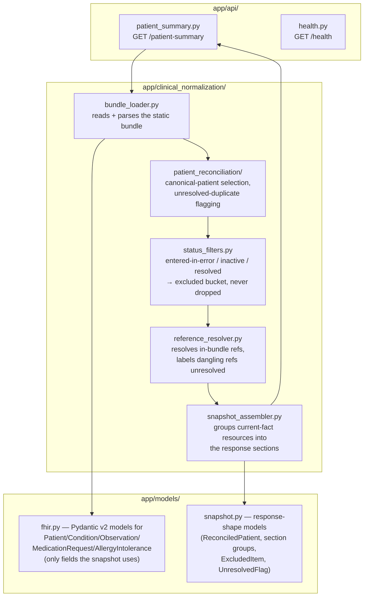
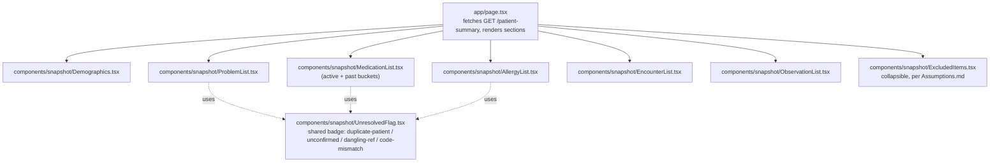
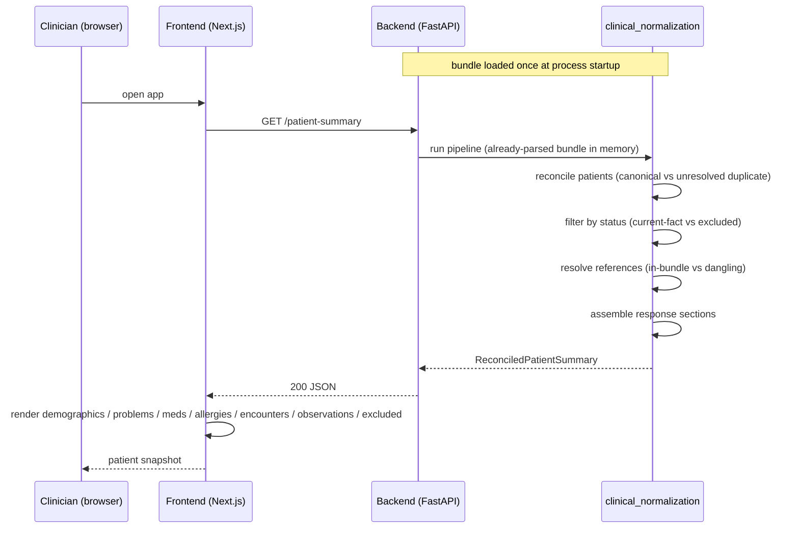

# High-Level Design — Centauri Clinical Snapshot

Draft for review (Phase 01). Architecture-level only — exact response field names, Pydantic model
shapes, and module-internal function signatures are `LLD.md`'s job, once this is confirmed. See
`project-plan/Assumptions.md` for the decisions this design encodes, and
`project-plan/ResearchNotes.md` / `implementation-logs/Knowledge.md` for the data-quality findings
driving the normalization requirements below.

## 1. Scope recap

- **MVP (auto-mode):** static bundle in → normalization/reconciliation pass → evaluation report out
  → frontend renders per-patient completeness.
- **Stretch (HIL/manual-mode):** user-uploaded bundle, same pipeline, plus in-browser editing and
  JSON download. Not designed in detail yet — the pipeline below is built so the stretch mode reuses
  it rather than forking it (upload replaces "load static file," everything downstream is the same).
- No database, no auth, no multi-patient support, single stateless request/response pass per
  `Assumptions.md`.

## 2. System context

Both services run under Docker Compose (`docker compose up`/`down`), no other infrastructure. The
backend reads the bundle file from disk once at process startup, not per-request — see
`Assumptions.md` → Scope ("loaded once, statically").

## 3. Backend components

**Module naming** (per `Assumptions.md` → Process): the package is `clinical_normalization`, matching
the brief's own phrase ("normalization pass that produces a clean, deduplicated, safe-to-display
representation"); the duplicate-`Patient`-merge logic specifically lives in the narrower
`patient_reconciliation` submodule inside it.

**Pipeline order matters:** reconciliation (which patient is canonical) happens before status
filtering, so that a resource's exclusion reason and its patient-linkage flag can both be attached
independently — e.g. `medicationrequest-003` needs the "linked to unresolved duplicate" flag from
reconciliation *and* passes through status filtering as `active`, ending up in the medications
section with a flag rather than in the excluded bucket (per `Assumptions.md`).

## 4. Frontend components

`UnresolvedFlag` is shared across sections rather than reimplemented per-section, since the same
"don't hide it, label it" treatment applies to several distinct cases (duplicate-patient linkage,
unconfirmed verification status, dangling reference, missing `display`, code/system mismatch).

## 5. Request flow (auto-mode)

## 6. Response shape (high-level — LLD owns exact field names)

Per `Assumptions.md`, the response is grouped by:

- `patient` — canonical patient demographics, `duplicate_of`/unresolved flag if applicable
- `active_problems`
- `medications` — `active` and `past` (e.g. `status: stopped`) as distinct buckets, not merged
- `allergies`
- `encounters`
- `observations`
- `excluded` — entered-in-error / inactive / resolved / (any other never-current-fact) resources,
  each with type, id, and a human-readable exclusion reason — included in the payload, not just
  summarized as a count (per `Assumptions.md`)

Every item carries enough provenance (status, verification status, resolution notes, flags) for the
frontend to render uncertainty honestly rather than presenting normalized data as more certain than
the source.

## 7. Key architectural decisions (recap — see `Assumptions.md` for full rationale)

| Decision | Why |
|---|---|
| Static, in-memory bundle load at startup, no DB | Single stateless pass over one bundle; a DB is unused scaffolding for this scope. |
| Reconciliation runs before status filtering | A resource can need both a duplicate-linkage flag and a status-based bucket independently (`medicationrequest-003`). |
| Excluded resources returned in-payload, not just counted | Matches "say so rather than hiding it"; lets the frontend render them as inspectable, collapsed items. |
| No guessing/backfilling anywhere in `clinical_normalization` | Hard rule — missing `display`, dangling refs, partial dates are surfaced as-is, never inferred into something more complete. |
| Stretch mode reuses the same pipeline | Upload replaces the static-file read; reconciliation/filtering/assembly stages don't change. |

## 8. Open questions for review

- Exact `/patient-summary` JSON field names/nesting (deferred to `LLD.md`).
- Whether `past medications` and `excluded` are top-level response keys or nested under a single
  `sections`/`meta` wrapper — leaning top-level for frontend simplicity, not yet decided.
- Backend port/frontend port and exact Compose service names — placeholders until `docker-compose.yml`
  is written.
- Error handling shape if the bundle fails to parse at startup (fail fast vs. degrade) — not yet
  addressed, worth a decision before LLD.
